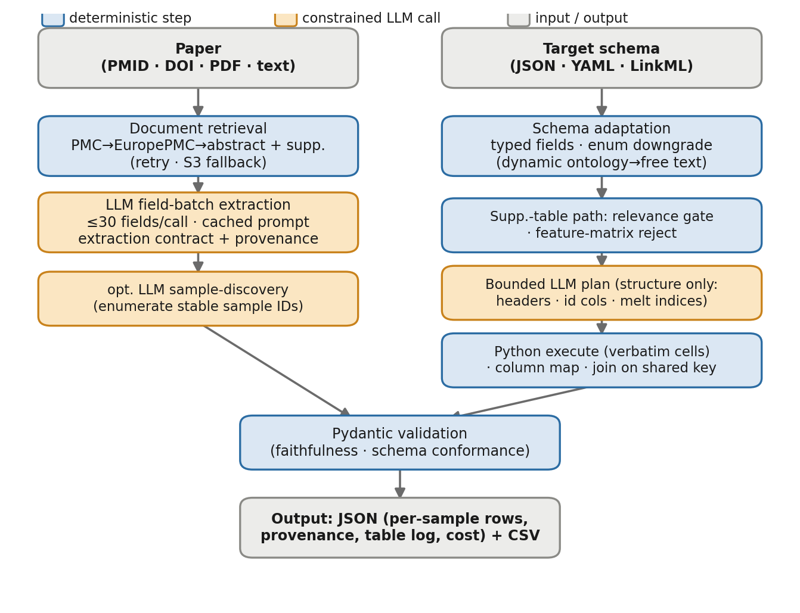
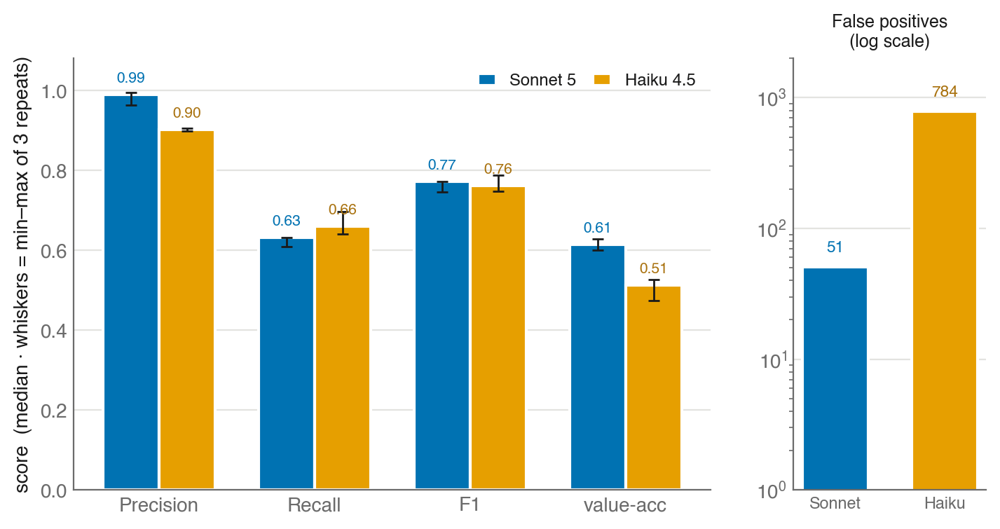
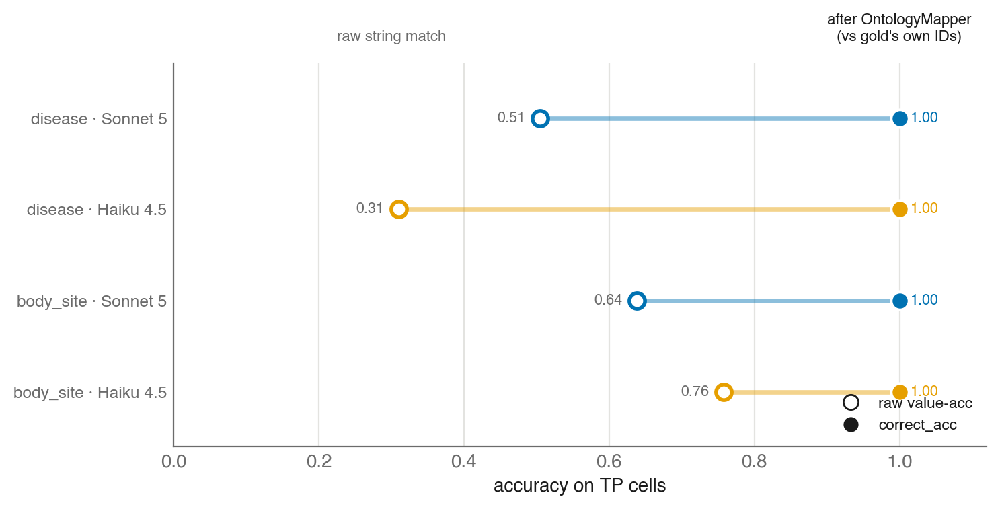

# MetaExtractor: a general-purpose large-language-model tool for extracting schema-conformant metadata from scientific literature, benchmarked on curatedMetagenomicData

## Abstract

**MetaExtractor** is a general-purpose large-language-model (LLM) tool that converts
free-text primary literature into structured, per-sample metadata conforming to *any*
user-supplied target schema (JSON, YAML, or LinkML), with per-field provenance and an
optional ontology-harmonization pass. Its design separates a deterministic spine —
document retrieval, schema adaptation, supplementary-table structuring, column mapping,
joining, and output — from a small number of constrained LLM calls, so the model
proposes content and structure but never mints an identifier or edits a data value.
Because a general-purpose extractor is only as credible as its hardest test, we evaluate
it in depth on one demanding domain — microbiome study metadata — using the
**curatedMetagenomicData** (cMD) curated `*_sample.tsv` tables as an independent gold
standard; the tool, its design, and the lessons below are not specific to microbiome
data. On ten reproducibly selected cMD studies we (i) compared two models —
Claude Sonnet 5 and Claude Haiku 4.5 — on an identical code snapshot, running each
study **three times per model** to separate genuine model variance from pipeline
noise, and (ii) tested whether a downstream harmonization pass through
**MetaHarmonizer** (SchemaMapper + OntologyMapper) closes the residual gap between
substantively-correct-but-differently-worded values and the curated vocabulary.

A fault-tolerant retrieval layer is central to making the pipeline reproducible:
extending retrieval to non-Open-Access full text (a free Europe PMC or Unpaywall-located
PDF where the structured-XML endpoints return only an abstract) and **autonomously
fetching each study's per-sample SRA/ENA run manifest** lifts per-sample enumeration from
four of ten studies to nine, deterministically — leaving only one study whose full text is
no longer reachable anywhere. On this pipeline the per-study sample counts are stable
across the three repeats.

On this refined pipeline Sonnet 5 is more precise
(precision 0.99, value accuracy 0.61, ~51 false positives), with an F1 now comparable to
Haiku's (0.77 vs 0.76); Haiku 4.5 is higher-recall (recall 0.66) but noisier
(precision 0.90, ~784 false positives);
the false positives decompose into a reproducible per-sample biomarker over-assertion on
one study and a scoring artifact from three recovered studies that deposit more runs than
the curated subset (under accession-keyed alignment their extra rows no longer count).
These recall figures use a positional join that scores only the extracted-vs-gold
overlap; counting the samples a study never enumerated as misses lowers recall to a
coverage-aware 0.31 (Sonnet) / 0.42 (Haiku), which is the honest end-to-end ceiling set
by ingestion coverage.

Ontology harmonization, once each field was mapped against the ontology the gold
standard actually uses, reached **100% correctness (`correct_acc`, scored against the
curators' own ontology identifiers)** on the two fields that carry them (disease,
body_site); the decisive factor was **corpus construction** — including the non-disease
"Healthy" code that labels cMD controls — not the matching algorithm. The transferable
lessons hold for any schema-driven extraction task, not only microbiome curation:
per-sample recall is set upstream by ingestion coverage rather than by model skill,
variance must be measured across repeats before point estimates are trusted, and
harmonization quality must be scored against an independent reference rather than the
tool's own self-consistency.

---

## 1. Introduction

Across the life sciences, the sample- and subject-level metadata needed to reuse a
public dataset is scattered through the free-text of its primary literature — the
methods section, the supplementary tables, and the linked data-repository records — in
idiosyncratic, unstructured forms. Turning that free-text into structured metadata that
conforms to a defined schema is a prerequisite for reuse, meta-analysis, and machine
learning, and it is today done largely by manual curation: accurate but labor-intensive.
**MetaExtractor** is a general-purpose tool that aims to accelerate this step for *any*
domain: given a paper and a user-supplied target schema, an LLM proposes per-field,
per-sample values under a strict faithfulness contract, and a deterministic layer
assembles and validates them. To measure such a tool honestly we need a large,
independently curated gold standard against a fixed schema. curatedMetagenomicData (cMD)
— a manually curated microbiome resource with a controlled schema and gold-standard
`*_sample.tsv` tables — is an exemplar of exactly the curation task the tool targets and
supplies that gold standard, so we use it as the evaluation domain throughout while
treating the tool and its findings as domain-general. Three questions determine whether
such a tool is usable in any curation workflow: (1) how accurate and how *safe*
(non-fabricating) is the extraction, and how does it depend on model choice; (2) how
*reproducible* is it — does the same input yield the same output across repeats; and (3)
can the raw extracted values be reconciled to a curated controlled vocabulary
automatically, so that substantively-correct answers stop being counted — and stored —
as mismatches.

This report addresses all three on a common set of ten cMD studies, using
MetaExtractor for extraction and MetaHarmonizer for harmonization. We emphasize two
methodological points that proved central. First, **variance is a first-class
result**: a single run cannot tell a fluke from a stable, reproducible defect, so each
(study, model) pair must be run several times before a point estimate is trusted or a
model is compared. Second, when evaluating ontology harmonization, *agreement* between
two harmonized values is not the same as *correctness*, and conflating them produces
inflated, misleading scores.

---

## 2. Methods

### 2.1 Evaluation domain and study selection

We evaluate MetaExtractor on curatedMetagenomicData because it supplies the conditions a
general extractor must be measured against: a large, independently curated gold standard
expressed in a fixed controlled schema, over papers whose per-sample metadata lives in
heterogeneous supplements and linked sequencing archives. Nothing in the pipeline is
specialized to this domain — the same schema-driven path would apply to any corpus with a
target schema and a reference standard — but cMD lets every claim below be checked against
curator-assigned values.

cMD curation tables (`curatedMetagenomicDataCuration/inst/curated/<study>/<study>_sample.tsv`)
were enumerated and shuffled with a fixed seed (42); the first ten studies with a
single clean numeric PMID and ≥1 sample were retained. The resulting set spans
15–363 gold samples per study: Bengtsson-PalmeJ_2015, TettAJ_2019_b, LiJ_2017,
NayakRR_2021, PasolliE_2019, Heitz-BuschartA_2016, FanY_2023, QinJ_2012,
ContevilleLC_2019, LiSS_2016.

### 2.2 MetaExtractor: design and extraction pipeline

MetaExtractor takes a paper (fetched by identifier, or supplied as text/PDF) and a
user-supplied target schema, and returns structured metadata as a JSON object with
per-field provenance. Its design deliberately separates a **deterministic spine**
(document retrieval, schema adaptation, supplementary-table structuring, column
mapping, joining, and output) from a small number of **constrained LLM calls**, so
that the model proposes content and structure but never mints an identifier or edits a
data value (Figure 1).

**Figure 1. MetaExtractor architecture.** Deterministic steps (blue) bracket a small
number of constrained LLM calls (orange). The model proposes field values, per-sample
identifiers, and table *structure*, but a Python layer copies every data value verbatim
and Pydantic validation enforces the extraction contract. The supplementary-table path
(right column) delegates only a single *bounded* plan call, which sees a truncated
preview and returns column indices — never cell values — before deterministic execution,
column mapping, and joining.

**The LLM footprint.** The entire pipeline reaches a model at exactly two call sites,
serving three roles: the per-field-batch *extraction* call (the semantic core); an
optional *sample-discovery* call that reuses the same extraction machinery to enumerate
per-sample identifiers from prose; and a bounded table-*plan* call that returns column
indices and a melt recipe. Every other stage — document retrieval and its narrative
scoring, the SRA/ENA manifest fetch, supplementary-table execution, column mapping,
joining, Pydantic validation, and output — is deterministic Python with no model in the
loop. Two properties make this footprint the pipeline's *trust boundary* rather than
merely its cost centre. First, the model **proposes content and structure but never
commits data**: a Python layer copies every cell verbatim by index and validation
enforces the extraction contract, so the model cannot mint an identifier or alter a value
even when it is wrong. Second, two of the three roles are **degradable** — sample
discovery is disabled by a flag and skipped whenever the deterministic table path already
yields rows, and a failed plan call falls back to a default header parse — so only the
field-extraction call is genuinely load-bearing. The design thus treats the LLM as the
one component that must read free-text prose, and routes around it wherever a source is
already machine-readable (Section 4.4).

**Inputs and schema handling.** The schema is loaded from JSON, native YAML, or a
LinkML YAML file; LinkML is auto-detected by content (the presence of `classes`/
`slots`/`enums`) rather than by file extension, and a specific class is selected with
`--linkml-class` when several are defined. Each slot becomes a typed field
(`string`/`number`/`enum`/`boolean`/`list`) carrying its description, unit, required
flag, and — for enums — a list of permissible values with optional labels. Enum
handling has one consequential detail: the LinkML adapter reads only a slot's *static*
`permissible_values`. A slot whose range is a *dynamic* enum (a LinkML `reachable_from`
ontology subtree with no enumerated members) has nothing to list, so it is downgraded
to a free-text `string` field rather than emitted as an empty, invalid enum. For the
cMD schema this downgraded the 11 `reachable_from` ontology-enum slots to free text
(a 71-field schema); the model receives no controlled vocabulary for those fields and
extracts free text — which is precisely what the downstream OntologyMapper
harmonization (Section 2.6) is meant to reconcile. Fields that *do* carry static
permissible values serialize those values — with their optional ontology-CURIE labels —
into the prompt, but as *identification guidance* only: the model uses them to locate
and disambiguate the target information and then returns the value **verbatim, in the
surface form the paper uses** (or `not_reported`), rather than snapping it to an allowed
value. Extraction commits the as-written value so provenance is preserved; mapping every
value — static-enum and dynamic-enum alike — onto the controlled vocabulary is deferred
to the same downstream OntologyMapper pass (Section 2.6). This makes the
extract-verbatim / harmonize-downstream split uniform across both enum kinds, differing
only in how much vocabulary guidance the model is given.

**Document retrieval.** The retrieval layer fetches article prose from a ladder of
sources — NCBI PMC full text, Europe PMC full text (by PMCID, and by DOI for preprints),
Europe PMC's free **rendered PDF** for non-Open-Access PMC records, and any Open Access
PDF **Unpaywall** locates at the publisher or in a repository — degrading to the PubMed
abstract only when none yields a body. The last two rungs matter because a large share of
biomedical papers are indexed but *not* in the PMC Open Access subset, so every
structured-XML endpoint returns only their abstract while the full text sits in a free
PDF; reaching it turns an abstract-only fetch into the complete body (and its
data-availability accession). Rather than accept the first source that returns any text,
the layer scores each candidate for *article-narrative* quality — section structure, a
taxonomy/table "junk" penalty, and a saturating length term, computed on the
reference-stripped text — and keeps the best, so a thin or table-dominated body from an
early rung does not terminate the search before a richer source is reached, and an
abstract never outranks a real body; the costlier PDF rungs are attempted only while no
body is yet clearly substantive. Independently, it fetches supplementary files from the
PMC AWS Open Data bucket and the Europe PMC supplementary ZIP. The layer is
fault-tolerant by design, which is what makes per-study enumeration reproducible across
repeats: (i) transient HTTP failures — rate-limit
429s, truncated reads, connection resets — are retried with backoff; (ii) the NCBI
`elink` PMID→PMCID step retries an intermittently empty response rather than treating
it as "no PMC record"; (iii) when the Europe PMC full-text fallback supplies the body,
supplementary-table retrieval is preserved — NCBI's declared file hrefs are not
discarded, and, failing those, the supplementary files are listed directly from the S3
version prefix — so falling back for prose never costs the enumeration-driving tables;
(iv) a DOI that resolves to a PMC article contributes its PMCID so supplementary files
are still fetched. The layer additionally implements one instance of a general pattern — when a schema's
entities are also deposited in a structured external repository, that repository can be
fetched as a deterministic per-entity fallback; here the repository is the sequencing
archive, and the same hook would target a different registry for a non-sequencing schema.
Concretely it resolves the study's **own** sequencing
project from the accessions in its data-availability statement — preferring a
BioProject/accession that appears in data-availability language over one the paper
merely references, and refusing to guess when the text is ambiguous — and fetches the
corresponding per-sample **run manifest** (run accession, instrument model, library
strategy, sample/host attributes) from the ENA `read_run` API, resolving run/sample/
secondary accessions to their project when no BioProject is stated. This supplies a
machine-readable per-sample manifest for studies whose article body and supplements
carry none — the dominant per-sample recall limiter (Section 3.3) — without a manual
download; the manifest enters the same deterministic table path as any supplementary
table, so `run_accession` and `instrument_model` map onto `ncbi_accession` and
`sequencing_platform` through the standard column aliases. (Resolving the project from
the paper's *own* data-availability accessions, rather than regex-scraping the first
BioProject in the text, is deliberate: the latter can capture a referenced or citing
study's project.)

**LLM extraction.** The (possibly supplement-augmented) paper text and the schema are
sent to the model in one call per field-batch. Schemas larger than 30 fields are split
into consecutive batches that are extracted independently and merged, so a large schema
does not force one enormous response; the shared system prompt and paper text carry
prompt-cache breakpoints, so each additional batch pays mainly for its own output. The
call uses the Anthropic messages API (no tool use); the system prompt is a fixed
"extraction contract" and the response must be a single JSON object, parsed and
validated against a fixed result model. The contract instructs the model to extract
only what the `<paper>` supports, never to use outside knowledge (including about the
cited datasets, cohorts, or authors), to return `not_reported` for absent fields, and —
critically for per-sample work — **not to invent per-sample rows from aggregates** (a
"mean age 65 ± 10, n = 240" stays study-level). Every reported value carries per-field
provenance: an extraction type (directly-stated / derived / inferred), a confidence, a
verbatim ≤25-word evidence quote, and the source section. These faithfulness rules are
enforced by the prompt contract and by schema validation of the output, not by a
separate programmatic quote-checker.

**Per-sample enumeration.** Per-sample rows are produced by one of two mutually
exclusive routes. When supplementary **tables** are parsed, the deterministic table
path below takes precedence and the row count is set there. Otherwise, when
supplementary prose is present but no table yields rows, an optional LLM
"sample-discovery" call enumerates a stable identifier for every subject/sample
(encoding subject, body site, and timepoint) and the field extraction is then
constrained to emit exactly those rows, in order. In *both* routes the per-sample row
count is ultimately a model-dependent structural decision — a melt/plan choice in the
table path, or the discovery call in the prose path — which is why sample enumeration,
rather than per-field accuracy, is the component that varies most run-to-run
(Section 3.3).

**Deterministic supplementary-table path.** Parsed supplementary tables (xlsx/csv/tsv,
PDF table regions) are handled on a separate, mostly-deterministic path rather than
pasted into the prompt as prose. Each table is first scored for schema relevance by a
deterministic gate (weighting header-name and enum-*value* overlap, an ID-column
signal, and shape); tables below a 0.15 relevance threshold are skipped, and
feature/measurement matrices (e.g. a taxa × samples abundance matrix) are detected and
rejected outright so they cannot be exploded into one output row per feature. For a
table that passes, a single *bounded* LLM "plan" call reads a truncated preview — the
schema field names plus the first ~20 rows of the raw grid — and returns only a
**structural** recipe (which rows are headers, where data begins, which columns are
identifiers, how to melt wide sub-columns into long form), expressed as 0-based column
indices and validated against a fixed schema. A pure-Python executor then applies that
plan, copying every cell value verbatim by index: the model proposes *structure* but
never produces, casts, or edits a *value*, and if the plan call fails the path falls
back to a default header parse. (Because the plan's melt decision sets how many long-
form rows a wide table yields, and that decision is the model's, the same parsed table
can enumerate very differently across models — the mechanism behind the divergent
per-study counts in Section 3.3.) The resulting columns are mapped to schema fields by a
deterministic lexical cascade (exact → normalized → curated alias → fuzzy), and multiple
tables are left-joined on the highest-priority shared key
(`sample_id` > `subject_id` > `ncbi_accession` > `study_name`) above a 0.9 value-overlap
threshold. Study-level and subgroup-level prose fields are then fanned out into each
row, and a value already carried by a table row is never overwritten.

**Deterministic value-semantics normalization.** A final deterministic pass
fills schema-declared value semantics the model tends to leave incomplete,
applied uniformly to study-level fields and every enumerated sample. For the cMD
schema the one instance is `age_min`/`age_max`, the *per-subject* age bounds,
filled from the best available evidence by precedence: a specific per-subject
age wins (both bounds set to it); otherwise a reported numeric range is kept
("subjects were 23 to 34 years old" → 23/34); otherwise, as a last-resort
fallback, the defining bounds of the record's `age_group` (e.g. `Adult` → 18/65).
The pass runs *after* fan-out, so propagated records are filled too, and — like
every other step on the deterministic spine — it only copies or derives values
(marked `derived` in provenance), never mints one. The mechanism is
schema-general; a different schema would declare its own such rules.

**Output and cost.** The result is a JSON object recording extraction granularity
(study/subgroup/sample-level), the per-field values with provenance, the per-sample
rows, a table-selection log (each table's relevance score, matrix flag, matched
columns, and keep/skip reason), and any warnings; a flat CSV (optionally with the
provenance columns) is also emitted. Token usage is tracked across all calls (including
the discovery and table-plan calls) and converted to a per-run cost estimate from a
built-in price table, accounting for Anthropic's cached-input discounts.

### 2.3 Extraction runs

MetaExtractor was run in its **by-PMID** mode against the 71-field cMD schema above,
with sample discovery enabled and the default 0.15 table-relevance gate. Both models —
`claude-sonnet-5` and `claude-haiku-4-5` — were run against the **same working-tree
snapshot**, so the only variable between models was the model itself.

### 2.4 Multi-seed protocol

To measure reproducibility, **each study was extracted three times per model** (10
studies × 2 models × 3 repeats = 60 extractions). LLM sampling is stochastic
(non-zero temperature), so repeats quantify genuine run-to-run variance. Each
extraction ran under a hard 25-minute wall-clock cap so a stalled generation could not
hang indefinitely. First-attempt failures were retried once. We report, per model, the
median and [min–max] of the headline metrics across the three repeats, and per study
the three individual sample counts.

### 2.5 Evaluation

Each extraction was scored against its gold `*_sample.tsv`. Extracted samples were
aligned to gold rows **positionally** (sample *i* ↔ gold row *i*), so sample count and
ordering are themselves measured outcomes. Every (sample, field) cell was labelled:
**TN** (both not reported), **TP_correct** (both reported and equal), **TP_wrong**
(both reported but differ), **FN** (gold has a value, extraction missed it), **FP**
(extraction asserts a value, gold blank). Content fields were micro-averaged into
precision, recall, F1, and value-accuracy (fraction of attempted cells whose value
matches gold exactly). Identifier/provenance fields were reported separately.

The positional join scores only the overlap `min(n_extracted, n_gold)`, and this
truncation cuts **both** ways. Extracted rows *beyond* the gold length are neither
scored nor penalized, so over-enumeration depresses the metrics only when the *leading*
rows are wrong (as in Haiku's LiJ_2017 feature-matrix explosion). Symmetrically, gold
rows *beyond* the number of extracted samples are **excluded from the denominator, not
counted as false negatives** — so a study the pipeline under-enumerates contributes
fewer cells, and a study that stays study-level (zero enumerated samples, e.g.
QinJ_2012) contributes **no per-sample cells at all** rather than a column of misses.
The headline recall is therefore a recall *over enumerated samples*, not over the full
gold; it does not, by construction, see the samples a study never enumerated. To make
the ingestion ceiling those un-enumerated samples represent directly visible, we also
report a **coverage-aware recall** in which every gold row with no corresponding
extracted sample counts its reported cells as FN (precision is unaffected, since a
phantom row asserts nothing). Metrics on over- or under-enumerating studies should be
read with this asymmetry in mind. A second caveat compounds it: study-level and
subgroup-level field values are fanned out into every sample row (Section 2.2), so a
single correct study-level value is counted once *per enumerated sample* — a
pseudo-replication that weights the micro-average toward high-enumeration studies and
their study-level fields.

### 2.6 Harmonization

A representative set of extractions was passed through MetaHarmonizer (v0.4.1). Because
the harmonization question — does the mapper reconcile surface-form variants to the
*correct* ontology code — concerns the mapping, not the extraction run, these results
are independent of extraction variance and are reported on a single representative run.

**SchemaMapper** (target = cMD) was applied to the free-text notes MetaExtractor
places in the `uncurated_metadata` field, to test whether structured signal buried in
prose maps back to cMD fields.

**OntologyMapper** was applied to three value fields — `disease`, `body_site`,
`treatment` — using the exact/embedding/synonym stages (Stages 1, 2, 2.5; the RAG and
LLM-review stages 3–4 were left disabled). Corpus construction was field-specific and,
critically, matched to the ontology the gold standard uses:

- **disease** — the v0.4.1 `CombinedCorpusBuilder` over the cMD `disease`
  specification: the NCIt root `C7057` ("Disease, Disorder or Finding") merged with the
  static term `C115935` ("Healthy"), yielding a 50,755-term corpus. The static term is
  essential: "Healthy" is cMD's most common disease value (it labels controls) yet is
  not a descendant of any disease subtree, so a plain root build omits it.
- **body_site** — cMD `body_site` is a static six-value enum with explicit UBERON
  meanings (e.g. feces → UBERON:0001988); the corpus is exactly those six UBERON terms.
- **treatment** — the NCIt "Pharmacologic Substance" subtree (C1909, 26,766 terms).

Scoring runs on the TP cells through a single code path — the shared
`metaextractor.evaluation.evaluate_both`, which scores a **raw** pass (values as
extracted, verbatim) and a **harmonized** pass (both extracted and gold values passed
through a `canonicalize` callable) and reports the cells the harmonized pass flips
`TP_wrong → TP_correct`. Here the canonicalizer maps a value to its OntologyMapper code
set, built from the same field-specific crosswalks. This yields three deliberately
separated metrics: **`raw value-acc`** — verbatim string equality (the extractor's
own output, no harmonization); **`agree_acc`** — the extracted and gold values,
mapped through the *same* OntologyMapper, resolve to the same code (self-consistency),
with **`recoverable`** the count of TP cells this reconciles from the raw pass; and
**`correct_acc`** — the OntologyMapper code for the *extracted* value equals the gold's
own curated `*_ontology_term_id` (true correctness), over the subset of cells carrying
a curated identifier. `recoverable` and `agree_acc` measure self-consistency and must
not be read as correctness (Section 4.1); only `correct_acc`, scored against the gold's
independent identifiers, does.

### 2.7 Reproducibility and cost

All extractions, per-cell audits, crosswalks, corpora, and scoring scripts are under
`benchmarks/cmd_sonnet5/`. The multi-seed runs are under `out_ms_refined/` (the refined
pipeline reported here, with autonomous SRA/ENA manifest and non-Open-Access PDF
recovery) and `out_ms/` (the same pipeline before that recovery, used for the
run-independent harmonization scoring of Section 3.6). Both positional and
accession-aligned content scorings are produced by the same `bench.py`/`aggregate.py`,
and the harmonization table (Section 3.6) regenerates from `bench.py harmonize`, which
drives the shared `evaluate_both` over the field crosswalks — superseding the standalone
`rescore.py`. Ontology corpora were built keyless from the NCI EVSREST and EBI OLS4 APIs.

---

## 3. Results

### 3.1 Model comparison — extraction

Content-field, micro-averaged metrics on the **refined pipeline** — the fault-tolerant
retrieval of Section 2.2 plus autonomous SRA/ENA run-manifest fetch and non-Open-Access
full-text recovery — as **median [min–max] over three repeats** per model.
The positional join scores all ten studies; because three of the newly-enumerated studies
deposit a *superset* of their curated samples (Section 3.3), we also report an
**accession-keyed alignment** over the five manifest-fed studies, which matches each
extracted run to its own gold row before scoring. Note that the two scorings are
**not directly comparable on recall**: the positional pass scores the overlap across
all ten studies, whereas the accession-keyed pass restricts to gold rows that matched an
extracted accession within the five manifest-fed studies (unmatched gold rows are
dropped), so its denominator is both smaller and differently composed. It is reported to
isolate the over-enumeration false-positive artifact, not as a like-for-like recall:

| scoring | model | Precision | Recall | F1 | value-acc | false positives |
|---|---|--:|--:|--:|--:|--:|
| positional (10 studies) | Sonnet 5 | **0.990** [0.963–0.994] | 0.631 [0.609–0.632] | **0.772** [0.746–0.772] | **0.615** [0.600–0.628] | 51 [33–192] |
| positional (10 studies) | Haiku 4.5 | 0.901 [0.898–0.906] | 0.660 [0.640–0.696] | 0.762 [0.748–0.787] | 0.512 [0.474–0.527] | 784 [781–785] |
| accession-aligned (5 SRA-fed) | Sonnet 5 | 0.985 [0.906–0.985] | 0.564 [0.522–0.576] | 0.717 [0.662–0.727] | 0.576 [0.541–0.577] | 31 [31–190] |
| accession-aligned (5 SRA-fed) | Haiku 4.5 | 0.916 [0.915–0.917] | 0.607 [0.589–0.618] | 0.730 [0.716–0.739] | 0.402 [0.357–0.406] | 196 [193–196] |

**Figure 2. Model comparison on the refined pipeline** (positional scoring; median of
three repeats; whiskers = min–max). *Left:* content-field rate metrics — Sonnet 5 is more
precise and value-accurate, Haiku 4.5 higher recall and F1. *Right:* false positives on a
log scale — Haiku emits ~784 against Sonnet's ~51; the gap in error *composition* remains
wide even as both rise with the newly-enumerated studies.

The two models trade off in the same direction, now with per-sample enumeration for nine
of ten studies rather than four (Section 3.3). Sonnet 5 remains far more precise and
value-accurate, and now edges Haiku on F1 (0.77 vs 0.76); Haiku 4.5 takes higher
recall (0.66) at a large
false-positive cost that decomposes into a stable single-study biomarker defect plus an
over-enumeration scoring artifact — itemised once in Section 3.3. Sonnet's rise
(2 → 51) is the same over-enumeration effect at smaller scale, though, unlike Haiku's,
its magnitude varies across repeats (Section 4.3). Much of both increases is a **scoring
artifact of over-enumeration**: three recovered studies deposit more runs than the curated
subset, so their extra rows count as false positives under the positional join but not
under accession alignment (where Sonnet FP falls to 31, Haiku to 196). Net, the refined
pipeline trades a modest, well-understood precision cost for per-sample coverage of five
studies that previously contributed nothing.

### 3.2 Reproducibility across repeats

Because per-sample enumeration is the component most exposed to model stochasticity
(Section 2.2), we quantify reproducibility directly by extracting each (study, model)
pair three times. On the refined pipeline the per-study sample counts are **identical
across all three repeats for both models on nine of the ten studies** (Table in
Section 3.3): the deterministic table path and the autonomously-fetched SRA/ENA run
manifest fix the row set, so most studies cannot vary run-to-run. The lone exception is
Sonnet 5 on FanY_2023, where one of three repeats over-enumerates (510 vs 319 rows);
Haiku is stable there at 319. The headline content metrics are correspondingly tight —
the [min–max] whiskers in Section 3.1 span a few points of precision and recall — with
the single consequence that Sonnet's *false-positive total* inherits that FanY
over-enumeration and ranges 33–192 (median 51; Section 4.3), even though its error
*profile* (precise, conservative) does not move. Reproducible per-study enumeration is
what lets the model comparison rest on point estimates rather than single lucky runs, and
it follows from the fault-tolerant, largely deterministic pipeline (Section 2.2) rather
than from the model.

### 3.3 Sample enumeration on the refined pipeline

Per-study extracted sample counts on the refined pipeline (gold *n*; three repeats each).
**Nine of ten studies now enumerate per-sample rows — up from four — and the counts are
stable across repeats:**

| study | gold n | Sonnet 5 (r1/r2/r3) | Haiku 4.5 (r1/r2/r3) |
|---|--:|--:|--:|
| Bengtsson-PalmeJ_2015 | 70 | **70 / 70 / 70** | **70 / 70 / 70** |
| TettAJ_2019_b | 44 | 50 / 50 / 50 | 50 / 50 / 50 |
| LiJ_2017 | 196 | 6 / 6 / 6 | **1448 / 1448 / 1448** |
| NayakRR_2021 | 34 | 434 / 434 / 434 | 434 / 434 / 434 |
| PasolliE_2019 | 112 | **112 / 112 / 112** | **112 / 112 / 112** |
| Heitz-BuschartA_2016 | 53 | 221 / 221 / 221 | 221 / 221 / 221 |
| FanY_2023 | 147 | 319 / 510 / 510 | 319 / 319 / 319 |
| QinJ_2012 | 363 | 0 / 0 / 0 | 0 / 0 / 0 |
| ContevilleLC_2019 | 15 | **15 / 15 / 15** | **15 / 15 / 15** |
| LiSS_2016 | 55 | 430 / 430 / 430 | 430 / 430 / 430 |

The counts are stable across repeats; the interpretable structure is:

- **Autonomous per-sample recovery.** Five studies that previously stayed study-level —
  Bengtsson-PalmeJ_2015, Heitz-BuschartA_2016, LiSS_2016, NayakRR_2021, and
  ContevilleLC_2019 — now enumerate from an **automatically-fetched SRA/ENA run manifest**
  (Section 2.2), with no manual input. Two recover their curated set exactly
  (Bengtsson 70 = gold; ContevilleLC 15 = gold, replacing a legacy `.xls` the parser
  rejects); the other three deposit a *superset* of the curated samples (Heitz 221 ⊇ 53,
  LiSS 430 ⊇ 55, NayakRR 434 ⊇ 34), and accession-keyed alignment confirms each manifest
  contains **100% of that study's gold runs** (53/53, 55/55, 34/34). Recovery is
  deterministic — identical across all three repeats and both models — because the manifest
  fixes the row set. What makes these studies reachable is the pair of non-Open-Access
  full-text rungs (Bengtsson via Europe PMC's free rendered PDF; Heitz and LiSS via a
  publisher/repository PDF located through Unpaywall) that surface the data-availability
  accession the structured-XML endpoints withhold, followed by the run-manifest fetch.
  **QinJ_2012 is the only study still at zero**: its sole open-access copy is a repository
  record that now returns "gone", so no full text — and thus no accession — is reachable.
- **A reproducible count-explosion — still distinct from the false positives.** Haiku
  enumerates LiJ_2017 as 1,448 samples in all three runs (gold 196) — it inflates an
  OTU/feature matrix into samples. Crucially, a deterministic tables-path run that
  enumerates exactly 196 (= gold) still emits the study's full false-positive block, so
  the explosion and the false positives are *separate* Haiku failure modes: the false
  positives are per-sample biomarker over-assertion (broken down below), not a by-product
  of the row count (Section 4.2). Sonnet under-enumerates the same study (6) in all three
  runs.
- **Over-enumeration magnitude.** Sonnet over-enumerates FanY_2023 at 319 or 510 across
  runs (gold 147); Haiku is stable at 319.

**Why the recovered studies lift enumeration more than per-field recall.** The
manifest-fed studies now enumerate their samples but recover only the fields an SRA/ENA
run manifest carries — run accession, instrument model, library strategy, and
host/body-site/country where present — not the full clinical panel; `age`, `treatment`,
`bmi`, and `dna_extraction_kit` are curated from paper text and remain false negatives.
Scored with accession alignment over the five manifest-fed studies (Section 3.1),
per-field recall is 0.56 (Sonnet) and 0.61 (Haiku) at precision 0.99 / 0.92. Under the
positional join the three *superset* studies are additionally penalized — their extra runs
count as false positives and their unaligned cells depress value-accuracy — which is why
the positional headline carries a higher false-positive count than the aligned one
(Sonnet 51 vs 31; Haiku 784 vs 196). Per-sample recall on these studies is therefore now
bounded by **SRA field coverage and value harmonization** (the OntologyMapper step,
Sections 2.6/3.6), not by manifest availability.

The 784 Haiku false positives decompose cleanly into the two mechanisms above: **588 from
LiJ_2017** — biomarker over-assertion, three fields fabricated on every sample where gold
is blank — plus **196 from the five newly-enumerated SRA studies**, confirmed by the
accession-aligned pass returning exactly 196 over those five. The former is a
prompt/contract defect a deterministic enumeration path does not touch; the latter is
largely the over-enumeration scoring artifact above.

| field (LiJ_2017) | false positives |
|---|--:|
| `biomarker_name` | 196 |
| `biomarker_value` | 196 |
| `biomarker_unit` | 196 |

### 3.4 Reliability — extraction failures

Across the 60 extractions, 6 first-attempt failures occurred (5 Haiku, 1
Sonnet), all of which succeeded on one retry (so the effective failure rate is ~10%
per attempt, ~0% within two attempts). All were LLM-output faults, not retrieval
faults: five were **malformed / truncated JSON** the extractor could not parse, and one
was the **`section: null`** case, where the model emits a null for a required
provenance field and the Pydantic result model rejects it. Both are current robustness
gaps worth closing (retry-on-parse-failure; coerce a null `section`), and both are more
frequent on the weaker model.

### 3.5 Harmonization — SchemaMapper on free-text

Of the unique `uncurated_metadata` strings supplied to SchemaMapper against the cMD
schema, **none matched a cMD field at high confidence (≥ 0.80)** and 17 matched at
moderate confidence (≥ 0.60), all via the semantic fallback rather than the
dictionary/fuzzy stages. The moderate matches route plausibly to ten distinct cMD
fields — e.g. *"Sequencing method: Shotgun metagenomic…"* → `sequencing_platform`,
*"Age categories: newborns, children…"* → `age_group`, *"Geographic locations:…"* →
`location`, *"Energy restriction diet…"* → `dietary_restriction`. A small amount of
recoverable structured signal is therefore buried in the free-text bucket and
SchemaMapper can suggest where it belongs, but nothing reaches promote-without-review
confidence; the tool is built for column headers, not narrative sentences.

### 3.6 Harmonization — OntologyMapper value harmonization

Scoring on TP cells (a representative run, `out_ms/*_r1`), regenerated by `bench.py
harmonize` through the shared `evaluate_both`: the raw string match, the two harmonized
metrics, and `recoverable` — the TP cells the harmonized pass reconciles from the raw
pass (`= (agree_acc − raw value-acc) × TP`):

| model | field | raw value-acc | `agree_acc` | recoverable | `correct_acc` | n with gold ID | TP cells |
|---|---|--:|--:|--:|--:|--:|--:|
| Sonnet 5 | disease | 0.505 | 0.751 | 76 | **1.000** | 162 | 309 |
| Haiku 4.5 | disease | 0.310 | 0.709 | 202 | **1.000** | 352 | 506 |
| Sonnet 5 | body_site | 0.638 | 1.000 | 112 | **1.000** | 162 | 309 |
| Haiku 4.5 | body_site | 0.758 | 1.000 | 112 | **1.000** | 308 | 462 |
| Sonnet 5 | treatment | 0.000 | 0.184 | 27 | — | 0 | 147 |
| Haiku 4.5 | treatment | 0.000 | 0.203 | 31 | — | 0 | 153 |

**Figure 3. Ontology harmonization converts substantively-correct-but-differently-worded
values into exact matches.** Open circles = raw string-match value-accuracy; filled =
`correct_acc` after OntologyMapper, scored against the gold's *own* curated ontology
identifiers. With a field-appropriate corpus — NCIt disease including the non-disease
"Healthy" code, UBERON for body_site — every coded cell resolves to the gold identifier
(`correct_acc` = 1.00). Treatment carries no gold identifier and is not shown.

These numbers are essentially unchanged from the pre-multi-seed extraction: `correct_acc`
stays exactly 1.00 on both coded fields, and `agree_acc` moves only in the third decimal.
Only Haiku's TP-cell counts shift marginally (disease 512→506, body_site 468→462,
treatment 160→153) because its representative run enumerates a few small studies slightly
differently; the mapping-correctness conclusion is independent of the extraction run.

The `recoverable` column makes the extraction/harmonization division of labour explicit:
these are cells MetaExtractor captured *verbatim* — the surface form as written in the
paper — that the raw pass scores as `TP_wrong` and harmonization reconciles once both
sides are mapped to a common code. On `disease` this is the dominant effect (76 of
Sonnet's, 202 of Haiku's TP cells), which is expected by design: MetaExtractor commits
the verbatim value for provenance and defers all standardization to MetaHarmonizer, so a
large raw `TP_wrong` is the intended behaviour rather than an extraction error. It is a
*self-consistency* count, not correctness — the correctness claim rests solely on
`correct_acc` against the gold's own identifiers.

**Disease and body_site are genuinely correct after field-appropriate corpus
construction.** With "Healthy" in the disease corpus, OntologyMapper resolves every
disease value that gold codes to the exact NCIt identifier the curators used (Healthy →
C115935, Type 2 Diabetes Mellitus → C26747, Hypertension → C3117, RA ↔ Rheumatoid
Arthritis → C2884): `correct_acc` = 1.00 on all coded cells, verified against the
gold's own identifiers, not against self-consistency. With body_site mapped to UBERON,
`feces` and `Stool` both resolve to UBERON:0001988, again matching gold on all coded
cells. Together this converts the dominant TP_wrong bucket — substantively-correct
values in a different surface form — into true matches, lifting raw value-accuracy
(disease 0.31–0.51, body_site 0.64–0.76) to full correctness on the coded cells
(Figure 3).

**The `agree_acc` / `correct_acc` distinction was necessary, not cosmetic.** A
deterministic mapper resolves a given value to the same code on both sides, so
agreement can be high even when the code is wrong; only correctness against the gold's
own identifiers separates reconciliation from error. A code-normalization bug that
briefly collapsed empty codes to the string `"nan"` illustrated the hazard — it
produced a `"nan"`↔`"nan"` agreement with no correctness — and was caught only by the
`correct_acc` check. In the reported configuration `agree_acc` (0.71–0.75) sits *below*
`correct_acc`, as it should.

**Treatment did not move, appropriately.** The treatment cells carry no curated
ontology identifier (so `correct_acc` is undefined), and the residual disagreements are
substantive rather than lexical: the extractor asserts a drug for subjects whose gold
`treatment` is "no"/"Not applicable". Harmonization correctly declines to reconcile a
real disagreement.

---

## 4. Discussion

### 4.1 A deterministic spine makes extraction reproducible

Reproducibility here is an engineering property rather than a lucky one. Because the
per-sample row set is fixed either by the deterministic supplementary-table path or by
the autonomously-fetched SRA/ENA manifest, and because the retrieval layer retries
transient failures rather than silently degrading, the same (study, model) pair returns
the same per-study enumeration across repeats for nine of ten studies (Section 3.2). The
only nondeterminism that survives lives in the narrow set of LLM-owned structural
choices — a melt/plan decision, a prose sample-discovery call — and in practice only one
moved run-to-run (Sonnet's FanY_2023 over-enumeration). The general point for anyone
benchmarking LLM curation from primary literature is that the retrieval and structuring
layers are part of the measurement apparatus: if they fail stochastically, apparent
"model variance" and even point estimates become uninterpretable, so their determinism
should be validated before a model is compared. Confining nondeterminism to an auditable
set of LLM calls (Section 2.2) is what makes the three-repeat variance small enough to
read.

### 4.2 Variance is a first-class result

Reporting three repeats reframed Haiku's low precision: the largest false-positive
block — 588 of the 784, concentrated on a single study (LiJ_2017) — is not noise but a
*stable*, reproducible defect. A follow-up isolates the mechanism: those false positives
are **not** the
feature-matrix count-explosion they visually coincide with — a deterministic re-run that
enumerates LiJ_2017 at exactly its 196 gold samples still emits all 588 — but per-sample
biomarker over-assertion (a fabricated biomarker on every sample, 196 × 3). The two are
separate failure modes, and only one (the explosion) is removed by a deterministic
enumeration path; the over-assertion is a prompt/contract issue that survives it. A
single-run benchmark would have reported the same 588 with no way to tell whether it was
a fluke or a fixed defect, let alone to separate the two mechanisms. Multi-seed
evaluation is cheap insurance against both false alarms and false confidence.

### 4.3 Model choice is a precision/coverage decision, not a quality ranking

On identical code, Sonnet 5 and Haiku 4.5 occupy opposite corners: Sonnet is precise and
conservative (precision 0.99, value-accuracy 0.61, ~51 false positives, and it fails
*safe* by staying study-level rather than fabricating rows), while Haiku is
higher-coverage and noisier (recall 0.66, F1 0.76, but ~784 false positives — a
reproducible biomarker over-assertion on one study plus an over-enumeration scoring
artifact on the recovered superset studies, not run-to-run noise — and a higher
malformed-output rate) at a fraction of the cost. Both false-positive counts are inflated
by the positional scoring of over-enumerated studies and fall under accession alignment
(Sonnet ~31, Haiku ~196; Section 3.1), so the *composition* of the gap matters more than
its headline size. One asymmetry in reproducibility should be stated plainly: Haiku's
false-positive count is tightly reproducible across the three repeats (781–785), but
Sonnet's is **not** — it ranges 33–192 (median 51; Table in Section 3.1), because a
single repeat over-enumerated FanY_2023 (510 vs 319 rows). Sonnet's *false-positive
total* therefore carries real run-to-run variance even though its error *profile*
(precise, conservative) is stable; the "reproducible defect" framing applies to Haiku's
588-FP biomarker block, not to Sonnet's smaller count. For a curation-assist setting where a fabricated or wrong cell is more
expensive than a blank one — because a human must catch and undo it — Sonnet 5's profile
is preferable; Haiku is the economical choice when every cell is verified downstream. F1
alone obscures this: the two models' F1 values are close (0.77 vs 0.76) while their error
composition is completely different.

### 4.4 Sample enumeration, not per-field skill, sets recall

Because scoring uses a positional join over the overlap `min(n_extracted, n_gold)`, a
study that stays study-level contributes **no per-sample cells to the positional
denominator at all** — its gold samples are excluded, not scored as a column of false
negatives (Section 2.5). The headline recall is thus a recall *over enumerated samples*;
enumeration governs recall by deciding **which** samples enter the denominator and how
heavily each study weighs, not by mechanically driving recall to zero on the studies
that enumerate nothing. The coverage-aware recall, which does count un-enumerated gold
rows as misses, makes the effect explicit: it falls to 0.31 (Sonnet) / 0.42 (Haiku),
roughly half the positional figure, and that gap **is** the enumeration/ingestion
ceiling. The studies that once enumerated zero samples did so not because the data was
absent but because the pipeline could not *ingest* a per-subject manifest that was in
fact reachable — and closing that gap is an engineering surface, not a model property. Extending retrieval to the two full-text sources that non-Open-Access articles
actually expose (a free Europe PMC rendered PDF; a publisher/repository PDF located
through Unpaywall) and then resolving each study's own project and fetching its ENA
`read_run` manifest recovered per-sample enumeration for **five of the six** previously
study-level studies, deterministically (Section 3.3). The single exception, QinJ_2012, is
now a true retrieval ceiling: its only open-access copy is a repository record that
returns "gone", so no full text — and thus no data-availability accession — is reachable.
Two lessons follow. First, per-sample recall is bounded upstream by **ingestion coverage**
— Open-Access/paywall handling and direct SRA/ENA fetch — far more than by model skill.
Second, enumeration recovery and per-field recall are distinct: the recovered studies now
contribute their samples, but an SRA/ENA manifest carries *technical* fields, so the
residual false negatives (age, treatment, BMI, extraction kit) are a **field-coverage and
harmonization** matter, not an enumeration one. The one place the model still clearly
matters is pathological enumeration: Haiku's reproducible inflation of a feature matrix
into 1,448 samples — driven by the bounded plan-step melt decision (Section 2.2) — is a
model behavior a *fully* deterministic enumeration path would prevent (though, as Section
3.3 notes, that does not remove Haiku's biomarker over-assertion, a separate
contract-level defect). More broadly, this is why the pipeline confines the model to a
single irreplaceable job — proposing values from free-text prose — and hands every
machine-readable source (a supplementary table, an ENA run manifest) to a deterministic
path instead: the trust boundary stays deterministic, and per-sample coverage improves
precisely as work moves *off* the model rather than onto it.

### 4.5 Harmonization works, but the lever is the corpus, not the matcher

The harmonization result — 100% *correctness* (`correct_acc`, scored against the gold's
own ontology codes, not `agree_acc` self-consistency) on the two fields that carry them —
was achieved with the exact/embedding/synonym stages alone,
with the RAG and LLM-review stages disabled. What made the difference was constructing
each field's corpus to match the gold: adding the non-disease "Healthy" finding code
(cMD's most frequent disease value, absent from every disease subtree), and mapping
body_site against UBERON. A matcher can only return concepts its corpus contains, coded
in the ontology the gold uses; once both conditions were met, mapping became exactly
correct. For anyone deploying ontology mapping over controlled-vocabulary metadata in any domain,
corpus scope and per-field ontology selection dominate; algorithm tuning is secondary.

### 4.6 Agreement is not correctness

Harmonizing both sides of a comparison and checking whether they match measures
*self-consistency*, and a deterministic mapper is trivially self-consistent even when it
is wrong: an incorrect value resolves to the same incorrect code on both sides, so the
two still agree. Only scoring the harmonized extraction against an independent reference
— here the gold's own curated ontology identifiers — distinguishes reconciliation from
correctness. A benchmark that reports the former while claiming the latter will
systematically overstate a harmonizer's quality; we recommend always reporting both,
over an explicit denominator of cells that carry a reference identifier.

### 4.7 Limitations

The study is small (ten studies) and uses a positional sample join, so recall is
sensitive to enumeration alignment rather than pure per-field accuracy. Because that
join aligns over `min(n_extracted, n_gold)`, extracted rows beyond the gold length are
not scored, so over-enumeration is penalized only when its *leading* rows are wrong;
metrics on over-enumerating studies carry this caveat. Three repeats
bound but do not fully characterize variance. The gold standard is itself heterogeneous
— it mixes raw and harmonized surface forms and populates `*_ontology_term_id` only
sparsely (treatment carries none on the relevant cells), which both depresses raw
value-accuracy and limits the denominator for `correct_acc`. OntologyMapper was run
without its RAG/LLM-review stages, so concept-level accuracy on harder free-text terms
is untested here. Harmonization was scored on a single representative extraction; while
the mapping-correctness conclusion is run-independent, the exact TP-cell counts are
not. The Sonnet 5 cost is a proxy (no price-table entry). Finally, `correct_acc` = 1.00
reflects the specific, largely low-cardinality controlled vocabularies exercised by
these ten studies and should not be extrapolated to open-ended disease text without the
higher OntologyMapper stages.

### 4.8 Recommendations

1. **Report variance.** Run each item multiple times; a single run cannot distinguish a
   fluke from a fixed defect. Validate that the retrieval and structuring layers are
   deterministic first, so any residual variance is genuinely the model's.
2. For curation-assist deployment, prefer the more precise model (Sonnet 5) and treat
   study-level fallback as a feature; reserve the cheaper model for fully human-verified
   passes.
3. Make per-sample enumeration fully deterministic where a machine-readable manifest
   exists: replace the table path's LLM plan/melt step (and the prose sample-discovery
   call) with deterministic structure inference, so the row count stops being a model
   decision — this removes the dominant source of run-to-run variance and prevents
   pathological count-explosions. Note it removes the explosion but *not* Haiku's
   biomarker over-assertion, which is a separate prompt/contract defect.
4. **Ingestion coverage is the primary recall lever — and largely mechanisable.** The
   refined pipeline reaches non-Open-Access full text through a free Europe PMC rendered
   PDF and an Unpaywall-located publisher/repository PDF, resolves each study's own project
   from its data-availability accessions, and fetches the ENA `read_run` manifest as a
   *fallback* used only when a study's own tables yield no rows (so it never perturbs
   studies that already enumerate). This recovered per-sample enumeration for five of six
   previously study-level studies with no manual input; the remaining lever is legacy
   `.xls` parsing and full text for the few genuinely paywalled articles. Resolve the
   project from the paper's *own* data-availability accessions, not by regex over the full
   text, to avoid capturing a referenced or citing study's project.
5. For ontology harmonization, invest in per-field corpus construction — include
   non-disease control codes and target each field's native ontology — and always score
   against the gold's own identifiers, reporting agreement and correctness separately.
6. Close the two extraction-robustness gaps surfaced here: retry on JSON-parse failure,
   and coerce a null `section` so extraction cannot crash.

---

## 5. Conclusion

MetaExtractor is a general-purpose, schema-driven extractor; curatedMetagenomicData is
the demanding domain we used to test it. On ten cMD studies, LLM extraction plus ontology
harmonization can reproduce the curated metadata well, but only when the pipeline is
judged on the right axes and with variance in view — and because none of the machinery is
microbiome-specific, the same conclusions describe how the tool should be expected to
behave, and be evaluated, on any schema-backed curation task. A fault-tolerant retrieval
layer and a largely deterministic pipeline make per-study enumeration reproducible across
repeats. Extending retrieval to the full-text sources non-Open-Access articles actually
expose (free Europe PMC and Unpaywall-located PDFs) and autonomously fetching each study's
SRA/ENA run manifest lifted per-sample enumeration from four of ten studies to nine,
deterministically — leaving a single genuinely unreachable article. Model choice is a precision-versus-coverage trade
rather than a quality ranking; extraction recall is set upstream by **ingestion coverage**
— which reachable full text and manifests the retrieval layer actually ingests (the
Open-Access boundary, publisher/repository PDFs, legacy formats, and direct SRA/ENA fetch),
a fixable engineering surface rather than absent data — with residual per-field gaps then
turning on SRA field coverage and value harmonization; and ontology harmonization, once
each field is mapped against a gold-matched corpus, reconciles the dominant surface-form
gap into fully correct codes on the fields that carry them. The recurring theme is that
the decisive engineering choices are in retrieval robustness, corpus construction, and
honest, variance-aware evaluation that separates self-consistency from correctness
against an independent reference.

---

*Data, code, per-cell audits, ontology corpora, and crosswalks are under*
`benchmarks/cmd_sonnet5/`. *Multi-seed extractions:* `out_ms_refined/` (the pipeline
reported here, 3 repeats × 2 models) *and* `out_ms/` (used for the run-independent
harmonization scoring). *Aggregated metrics:* `out_ms_refined/AGGREGATE.md`.
*Harmonization scoring:* `harmonize/rescore_value_accuracy.csv`.
